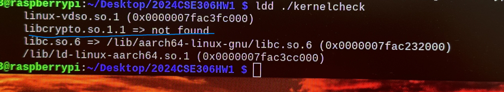
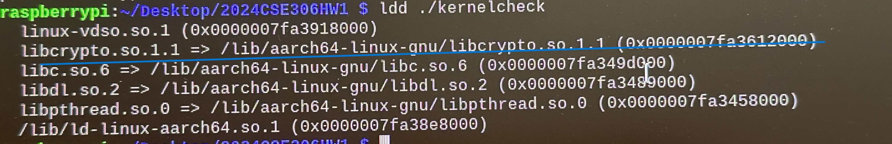

## How to use

1. Clone Repository  
  ```
  $ git clone https://github.com/CELL-DGIST/2025CSE306HW1.git
  ```

2. Go to 2025CSE306HW1 Directory.  
  ```
  $ cd 2025CSE306HW1
  ```

3. Run `chmod` to give execute permission.  
  ```
  $ chmod 755 kernelcheck
  ```

4. Execute
  ```
  $ ./kernelcheck
  ```
 - 실행결과로 `encrypted_result.txt` 파일이 생성됩니다.   
   이 파일을 과제로 제출하시면 됩니다.  
 
 - 실행 결과로 터미널에 커스텀 커널을 잘 빌드하였는지 체크결과가 출력됩니다.
    - `Pass!` : 요구사항에 맞게 잘 수행하셨습니다. *encrypted_result.txt*를 제출하세요.
    - `Fail... You need to check again.` : 커널이 잘못 빌드되었습니다. PPT를 보고 Imager 초기화 부터 다시 실행하세요.

- Check the encrypted result (결과가 256 바이트로 이뤄지지 않은 경우 채점이 올바르게 진행되지 않을 수 있으니 유의해주세요.)
  ```
  $ xxd encrypted_result.txt 
  ```
  <details>
  <summary> encrypted_result.txt 예시 보기</summary>
  
    ```
    00000000: 7ebb 68f8 8007 53a8 e4e5 1778 cb73 4f47  ~.h...S....x.sOG
    00000010: 6d5d 81a3 76eb d249 a130 9df1 a126 5f34  m]..v..I.0...&_4
    00000020: edf2 c870 9d3c 4ab7 3014 c924 d8b8 7ee4  ...p.<J.0..$..~.
    00000030: 5173 7910 6896 d494 0e56 6f33 9c98 d748  Qsy.h....Vo3...H
    00000040: 4ae3 5563 f894 c98c 851c edf6 88b6 50dd  J.Uc..........P.
    00000050: 5737 28a5 41ef 11bd 8e0f fe57 e07a 8c86  W7(.A......W.z..
    00000060: 8edd efd6 d064 dfa2 1136 668b d08e 6155  .....d...6f...aU
    00000070: 3560 a70d 04aa 3c95 c938 bc9b a2c7 62cf  5`....<..8....b.
    00000080: a4ae edae bd7e b8d5 c7e5 fd6e ba06 a92e  .....~.....n....
    00000090: 482b 31a3 a5a1 ad1a 0b31 ed9e d65a e3c1  H+1......1...Z..
    000000a0: b261 bae0 7551 fbaa 1a98 0e2e 4ac4 26ca  .a..uQ......J.&.
    000000b0: a4b8 28c1 09cb f9ef 7f35 578e 249e ce17  ..(......5W.$...
    000000c0: c1e2 2002 8e1f 19de 22ec 41b2 0470 1ef7  .. .....".A..p..
    000000d0: d775 ad7f 0cb8 5f54 c139 d93a 5b86 6d46  .u...._T.9.:[.mF
    000000e0: 36a6 3ed2 e90b b5b6 3c3a 1399 047a c2e2  6.>.....<:...z..
    000000f0: 324b c792 fd67 decf 183b 58e1 971b c578  2K...g...;X....x
    ```
  </details>
<br>
<br>
<br>
<br>

## possible issues

```
1. error while loading shared libraries : libcrypto.so.1.1: cannot open shared object: No such file or directory   
```
제일 마지막 ./kerneltest 단계에서 해당 문제가 발생 가능합니다.   
<br>
원인) 노트북 및 데스크탑에서 필수 패키지들을 설치(apt-get)하는 라이브러리에서 더이상 libcrypto.so.1.1을 지원하지 않음.     
해결 방법)   
    (1) "ldd ./kernelcheck" 확인 시 아래와 같이 shared object file을 찾지 못함. 
    (2) 아래의 명령어로 libcrypto.so.1.1 파일을 해당 경로로 이동   

    ```
    $ mv ./libcrypto.so.1.1 /lib/aarch64-linux-gnu
    ```
  (3) "ldd ./kernelcheck"로 정상적으로 linking이 되었는지 확인 

* 주의) 튜토리얼대로 진행했다면, 파일 실행 시 linking을 하기 위해 shared library를 /lib/aarch64-linux-gnu의 경로에서 찾게 됩니다.    
파일 시스템이 다른 구조를 갖는다면 해당 경로가 다를 수 있습니다. 
    
